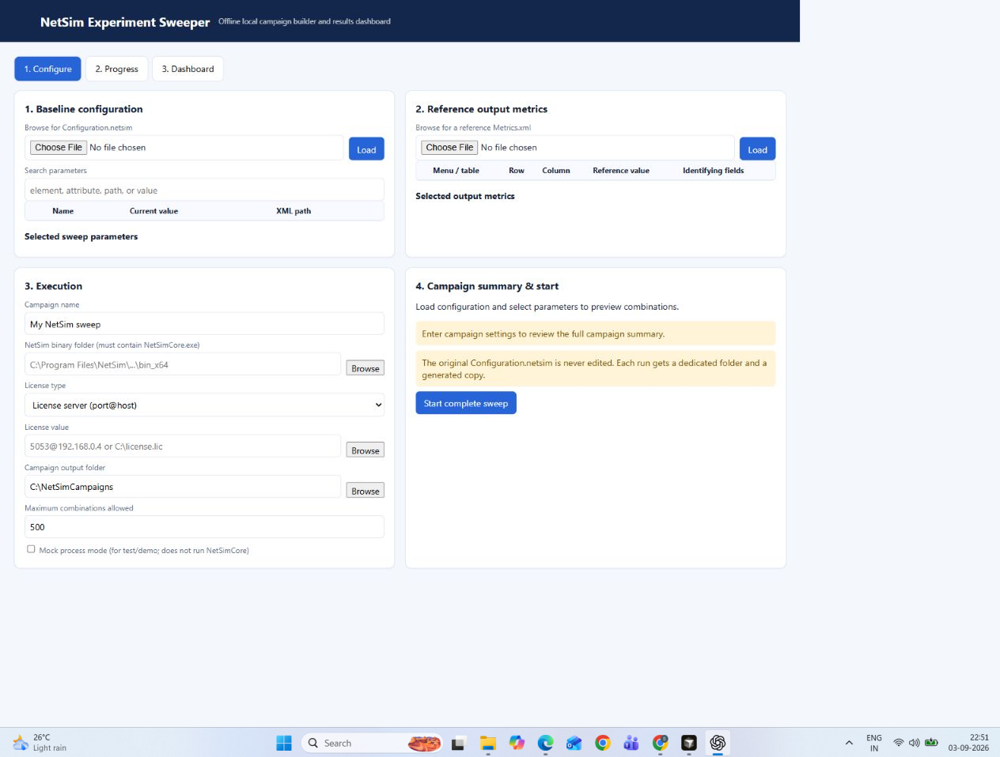
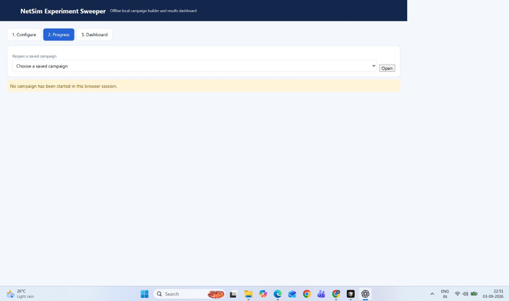
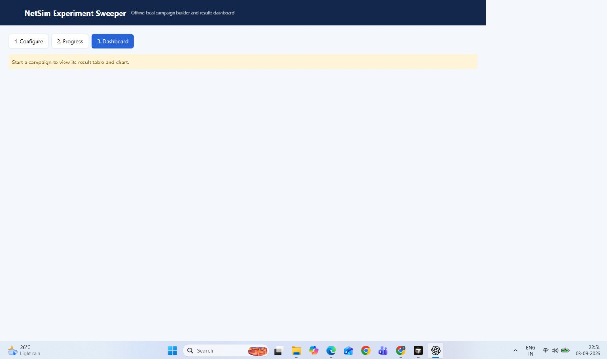

# NetSim Experiment Sweeper

> A local-first experiment runner for repeatable NetSim parameter sweeps, live
> progress tracking, and cumulative result analysis.

NetSim Experiment Sweeper turns a tedious sequence of manual simulation runs
into a reproducible campaign. Choose editable values from a
`Configuration.netsim`, select metrics from a reference `Metrics.xml`, and let
the application generate, execute, monitor, and analyse the complete Cartesian
product of your experiment.

It runs entirely on your machine: the backend uses only Python's standard
library, the browser UI is served locally, and uploaded baselines are preserved
unchanged.



## Highlights

- **Visual experiment setup** — discover XML leaves and attributes, search them,
  and define list or numeric-range parameters without hand-editing files.
- **Cartesian-product campaigns** — calculate the exact run count before launch
  and execute every parameter combination consistently.
- **Real NetSim integration** — invokes `NetSimCore.exe` with configurable
  application path, I/O path, and server/file licensing.
- **Safe, isolated outputs** — every run gets its own folder containing the
  generated configuration, metrics, process log, and result row.
- **Live operational visibility** — follow pending, running, passed, failed,
  cancelled, and metrics-missing runs with timestamps and process output.
- **Interactive dashboard** — filter and sort cumulative results, choose X/Y/group
  axes, and download the campaign CSV.
- **No-NetSim demo mode** — deterministic mock execution makes the workflow easy
  to evaluate or test on any Windows machine.
- **Campaign persistence** — reopen saved campaigns and results after restarting
  the application.

## Quick start

### Requirements

- Windows
- Python 3.10 or later
- NetSim installation and a valid licence for real simulations

No third-party Python packages are required.

### Launch

1. Clone or download this repository.
2. Double-click [`launch.bat`](launch.bat), or run:

   ```powershell
   python app.py
   ```

3. Open <http://127.0.0.1:8765>.

The server is local-only and does not require an internet connection.

## Create a campaign

1. On **Configure**, load a `Configuration.netsim`.
2. Search the discovered XML fields, select parameters, and provide either:
   - comma-separated values, such as `New_Reno,CUBIC`, or
   - a numeric range with start, stop, and step.
3. Load a reference `Metrics.xml`, select output metrics, and name the CSV
   columns.
4. Select the NetSim binary folder containing `NetSimCore.exe`, then provide
   server or file licence details.
5. Choose an output folder, review the calculated run count, and start the
   campaign.
6. Monitor execution on **Progress** and inspect or download results on
   **Dashboard**.



## Test without NetSim

Use the included sample files:

- `samples/Configuration.netsim`
- `samples/Metrics.xml`
- `samples/sample_campaign.json`

Enable **Mock process mode** on the Configure screen. The mock runner creates
deterministic results without starting NetSim.

Run the automated smoke test:

```powershell
python tests/mock_process_test.py
```

## Output layout

The application never edits the uploaded baseline. A campaign is stored like
this:

```text
<output>/
└── <campaign-id>/
    ├── campaign.json
    ├── cumulative_results.csv
    └── run_0001/
        ├── Configuration.netsim
        ├── Metrics.xml
        └── process.log
```

Each run receives a copied configuration before parameter values are applied.
This keeps campaigns auditable and prevents one run from contaminating another.

## NetSim command

For a real run, the application executes:

```text
NetSimCore.exe -apppath <binary folder> -iopath <per-run folder> -license <port@host | license file>
```

The selected executable and file licence are verified before a campaign starts.
The exact NetSim behaviour still depends on the installed NetSim version and
simulation configuration.

## Project structure

| Path | Purpose |
| --- | --- |
| [`app.py`](app.py) | Local HTTP server, XML handling, campaign runner, CSV writer |
| [`index.html`](index.html) | Configure, Progress, and Dashboard UI |
| [`launch.bat`](launch.bat) | Windows launcher |
| [`samples/`](samples) | Reusable configuration, metrics, and campaign examples |
| [`tests/mock_process_test.py`](tests/mock_process_test.py) | Deterministic smoke test |
| [`AI_USAGE.md`](AI_USAGE.md) | AI-assisted development notes and validation record |
| [`LICENSE`](LICENSE) | MIT License |



## Design principles

- **Local-first:** simulation inputs and outputs stay on the workstation.
- **Reproducible:** campaign definitions, generated inputs, logs, and results
  are retained together.
- **Fail visibly:** invalid ranges, missing executables, ambiguous metrics, and
  failed runs are surfaced instead of silently ignored.
- **NetSim-aware, XML-general:** the current metric selector uses structured XML
  table/row/column identity and identifying fields without hard-coding a
  particular model.

## License

This project is licensed under the [MIT License](LICENSE).

NetSim itself is third-party software and remains subject to its own license
and usage terms. This license applies to this project’s source code and
documentation.
